<!--
  Profile README for github.com/alyssahoang
  Palette mirrors alyssatramnia.com: bg #111827 · primary #3B82F6 · light #93C5FD · accent #F27D0D · chip #1F2937
  Sections: intro → tech → contact (works and metrics removed to keep it lean)
  Header: assets/lofi-desk.svg (hand-made animated SVG, regenerate with gen_lofi.py if you want to tweak it)
-->

 

&nbsp;
&nbsp;
&nbsp;

E-commerce · Customer Experience · Consulting · Market Intelligence

 

###  About Me:

- 📊 I'm a **Data & Insights Analyst** with 4+ years in international e-commerce and consulting
- 🎓 Fresh MSc graduate in Data Science (University of Warsaw · University of Milan), based in Poland
- 🔍 I specialise in automated pipelines, BI dashboards and actionable insights on customer behaviour
- 🧪 Currently experimenting with **AI automation in Power BI**
- 🏃 Fun fact: I run almost everyday 
- 🧑‍💻 Tech I work with:

  

  

 

<!-- "On GitHub" metrics card: hidden (duplicates the profile page). Re-enable by removing this wrapper and turning the schedule back on in .github/workflows/metrics.yml
## On GitHub
Contributions and the languages behind them. Generated daily by the Metrics workflow.

 
-->

<!--
  Optional "now playing" widget (needs a one-time Spotify login):
  1. Open https://spotify-github-profile.kittinanx.com/ and sign in with Spotify.
  2. Copy the generated URL and paste it here:
  
-->

